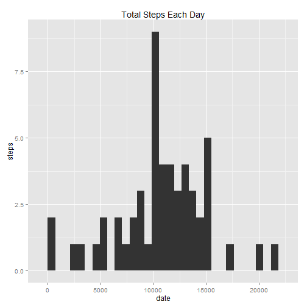
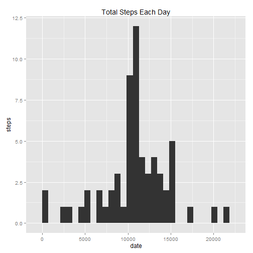

## Loading and preprocessing the data

1.Load the data 

```r
activity <- read.csv("activity.csv")
```

2.Transform the data 

```r
activity$date <- as.Date(activity$date, "%Y-%m-%d")
```

## What is mean total number of steps taken per day?


1. Make a histogram of the total number of steps taken each day

```r
steps.date <- aggregate(steps ~ date, data = activity, FUN = sum)
library("ggplot2")
qplot(steps.date$steps, main = "Total Steps Each Day", xlab = "date", ylab = "steps")
```

```
## stat_bin: binwidth defaulted to range/30. Use 'binwidth = x' to adjust this.
```

 

2. Calculate and report the mean and median of the total number of steps taken per day

```r
mean_step <- mean(steps.date$steps)
median_step <- median(steps.date$steps)
```
- Mean: 1.0766189 &times; 10<sup>4</sup>
- Median: 10765

## What is the average daily activity pattern?

1.Make a time series plot (i.e. type = "l") of the 5-minute interval (x-axis) and the average number of steps taken, averaged across all days (y-axis)

```r
average_steps.interval <- aggregate(steps ~ interval, data = activity, FUN = mean)
plot(average_steps.interval, type = "l")
```

 

2.Which 5-minute interval, on average across all the days in the dataset, contains the maximum number of steps?

```r
max_interval <-average_steps.interval$interval[which.max(average_steps.interval$steps)]
```

- The interval contains the maximum number of steps is: 835

## Imputing missing values

1.Calculate and report the total number of missing values in the dataset 


```r
total_miss_value<- length(which(is.na(activity$steps)))
```

- The total number of missing values in the dataset is: 2304 

2.Devise a strategy for filling in all of the missing values in the dataset.
      
- The strategy that I am using at here is to use the means for the 5-minute intervals as fillers for missing values.

3.Create a new dataset that is equal to the original dataset but with the missing data filled in.

```r
steps.interval <- aggregate(steps ~ interval, data = activity, FUN = mean)
new_activity <- merge(activity, steps.interval, by = "interval", suffixes = c("", ".y"))
na_value <- is.na(new_activity$steps)
new_activity$steps[na_value] <- new_activity$steps.y[na_value]
new_activity <- new_activity[, c(1:3)]
```


4.Make a histogram of the total number of steps taken each day and Calculate and report the mean and median total number of steps taken per day.


```r
new_steps.date <- aggregate(steps ~ date, data = new_activity, FUN = sum)
qplot(new_steps.date$steps, main = "Total Steps Each Day", xlab = "date", ylab = "steps")
```

```
## stat_bin: binwidth defaulted to range/30. Use 'binwidth = x' to adjust this.
```

 

```r
new_mean_step <- mean(new_steps.date$steps)
new_median_step <- median(new_steps.date$steps)
```
- Mean: 1.0766189 &times; 10<sup>4</sup>
- Median: 1.0766189 &times; 10<sup>4</sup>

Do these values differ from the estimates from the first part of the assignment? 

- yes.  The mean value unchanged but the median value increased and it is the same as mean.
  
Before imputing missing data
- Mean: 1.0766189 &times; 10<sup>4</sup>
- Median: 10765

After imputing missing data
- Mean: 1.0766189 &times; 10<sup>4</sup>
- Median: 1.0766189 &times; 10<sup>4</sup>
  
  
  
What is the impact of imputing missing data on the estimates of the total daily number of steps?
  
  Imputing the missing data seems incresed the peak value but no impact of the data distribution.
  
## Are there differences in activity patterns between weekdays and weekends?

1.Create a new factor variable in the dataset with two levels - "weekday" and "weekend" indicating whether a given date is a weekday or weekend day.


```r
new_activity$datetype <-  ifelse(as.POSIXlt(new_activity$date)$wday %in% c(0,6), 'weekend', 'weekday')
```

2.Make a panel plot containing a time series plot (i.e. type = "l") of the 5-minute interval (x-axis) and the average number of steps taken, averaged across all weekday days or weekend days (y-axis).


```r
new_activity_avg <- aggregate(steps ~ interval + datetype, data=new_activity, mean)

library(lattice)
xyplot(steps ~ interval | datetype, new_activity_avg, 
       type="l", lwd=1, xlab="Interval", ylab="Number of steps", layout=c(1,2))
```

 
There are some difference based on this plot.  More activities happened throughtout the day during the weekday.
